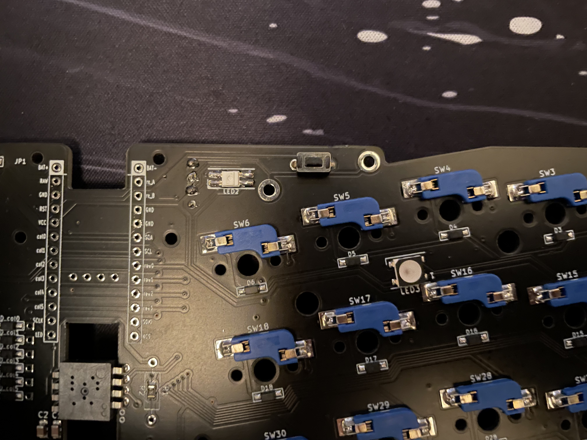

# cocochi

cocochi は [aki27](https://twitter.com/aki27kbd) さん制作の [cocot46plus](https://shop.yushakobo.jp/products/pre-order-cocot46plus) のガスケットマウントアクリル積層ケースです.
この商品ははんだ済みの PCB を持っている人を想定しています.

## 基本的な同梱物 ( 試作キットによって多少違いますが、基本的には同じです )

- ケース
- ケースフォーム
  - PORON LE-20 or PORON LE-32 or コルク
- スイッチフォーム
- スイッチプレート
- ガスケットフォーム
  - PORON or シリコンゴム
- トラックボールケース
  - アクリル積層トラボケース or 3D プリントトラボケース
  - トラックボールケース締結用のネジ
- 支持球 or ベアリング
- ゴム足

## 入ってないもの

- cocot46plus の PCB
- cocot46plus の付属品 (OLED や リセットスイッチなど )
- 34mm トラックボール
- キースイッチ
- キーキャップ
- promicro 系

## toc

1. 中身の取り出し
1. ケースフォームの設置
1. PCB の設置
   1. リセットスイッチについて
1. スイッチフォームの設置
1. スイッチプレートの設置
1. OLED のピンヘッダー
1. トラックボールケースの設置
1. 完成!!

## 中身の取り出し

まずはケースの中身を取り出すためにケースのネジを取り外して中身を取り出します.

横から見るとこんな感じで真ん中あたりまで徐々に大きくなっています.

## ケースフォームの設置

ケースフォームは複数の厚みのものを用意しているので, お好みの打鍵感, 打鍵音に合わせて設置してください.

## PCB の設置

前の手順で設置したケースフォームの上に PCB を設置します.

### リセットスイッチについて

リセットスイッチを逆向きにはんだすることによってケースの底側からリセットスイッチをポチることが可能です.

## スイッチフォームの設置

前の手順で設置した PCB の上にスイッチフォームを設置します.

## スイッチプレートの設置

スイッチフォームの上にスイッチプレートを置き,キースイッチを設置していきます (四隅から止めていくことをオススメします).

## OLED のピンヘッダー

OLED のピンヘッダーの上にはみ出ている部分を短めにカットします.
写真くらいまでカットすれば問題なくケースにはめられるはずです.

## トラックボールケースの設置

### トラックボールケースとキーボードケースの締結

まずはトラックボールケースを付属の M2 x 3mm ネジを使ってケース側の一番上のアクリルに設置します.

### 支持球の取り付け

トラックボールケースを取り付けたケースをひっくり返して, 支持球を図のように設置します.

### 34mm トラックボールの設置

トラックボールケース天面のネジを外して一枚分だけアクリル板を取り外します.

外したところにトラックボールを置いて, 天面を元に戻します

トラックボールケースは下から上にかけて徐々に小さくなっているので, 迷ったらこの形状を目安にしてください.

## 完成!!

最後にケースの上側のネジ(最初の手順で外したネジですね)を全箇所にとめて完成です. (この写真は (Daihuku)[https://twitter.com/Daihuku0015] さんにキー部 3%のときに撮っていただきました)

